# [2_200_002 and 1_100_001](../../number.test.js)

```js
assert({
  actual: 2_200_002,
  expect: 1_100_001,
});
```



<details>
  <summary>see without style</summary>

```console
AssertionError: actual and expect are different

actual: 2_200_002
expect: 1_100_001
```

</details>


---

<sub>
  Generated by <a href="https://github.com/jsenv/core/tree/main/packages/tooling/snapshot">@jsenv/snapshot</a>
</sub>
