# [special notations](../../number.test.js)

```js
assert({
  MAX_DIFF_PER_VALUE: 10,
  actual: {
    a: 3.65432e12,
    b: 0b10101010101010, // binary
    // prettier-ignore
    c: 0B10101010101010, // binary 2
    d: 0xfabf00d, // hexadecimal
    e: 0xabcdef,
    f: 0o010101010101, // octal,
    // prettier-ignore
    g: 0O010101010101, // octal 2
  },
  expect: {
    a: 3.656732e8,
  },
});
```



<details>
  <summary>see without style</summary>

```console
AssertionError: actual and expect are different

actual: {
  a: 3_654_320_000_000,
  ↓ 6 props ↓
}
expect: {
  a: 365_673_200,
}
```

</details>


---

<sub>
  Generated by <a href="https://github.com/jsenv/core/tree/main/packages/tooling/snapshot">@jsenv/snapshot</a>
</sub>
