# [false should be an object](../../object.test.js#L49)

```js
assert({
  actual: false,
  expect: { foo: true },
});
```



<details>
  <summary>see without style</summary>

```console
AssertionError: actual and expect are different

actual: false
expect: {
  foo: true,
}
```

</details>


---

<sub>
  Generated by <a href="https://github.com/jsenv/core/tree/main/packages/independent/snapshot">@jsenv/snapshot</a>
</sub>
