# [many props should not be there](../../object.test.js)

```js
assert({
  actual: {
    a: true,
    b: true,
    c: { an_object: true, and: true },
    d: true,
    e: true,
    f: true,
    g: true,
    h: true,
  },
  expect: {
    a: true,
    c: {},
  },
  MAX_DIFF_PER_VALUE: 3,
});
```



<details>
  <summary>see without style</summary>

```console
AssertionError: actual and expect are different

actual: {
  a: true,
  b: true,
  c: {
    an_object: true,
    and: true,
  },
  ↓ 5 props ↓
}
expect: {
  a: true,
  c: {},
}
```

</details>


---

<sub>
  Generated by <a href="https://github.com/jsenv/core/tree/main/packages/tooling/snapshot">@jsenv/snapshot</a>
</sub>
