# [max 2 context around diff](../../object.test.js)

```js
assert({
  actual: {
    a: true,
    b: true,
    c: true,
    d: true,
    e: true,
    f: true,
    g: true,
    h: true,
    i: true,
    j: true,
    k: true,
    l: true,
    m: true,
    n: true,
    o: true,
    p: true,
  },
  expect: {
    a: true,
    b: true,
    c: true,
    d: false,
    e: true,
    f: true,
    g: true,
    h: false,
    i: true,
    j: true,
    k: true,
    l: true,
    m: false,
    n: true,
    o: true,
    p: true,
  },
  MAX_DIFF_PER_VALUE: 3,
});
```



<details>
  <summary>see without style</summary>

```console
AssertionError: actual and expect are different

actual: {
  ↑ 2 props ↑
  c: true,
  d: true,
  e: true,
  f: true,
  g: true,
  h: true,
  i: true,
  ↕ 2 props ↕
  l: true,
  m: true,
  ↓ 3 props ↓
}
expect: {
  ↑ 2 props ↑
  c: true,
  d: false,
  e: true,
  f: true,
  g: true,
  h: false,
  i: true,
  ↕ 2 props ↕
  l: true,
  m: false,
  ↓ 3 props ↓
}
```

</details>


---

<sub>
  Generated by <a href="https://github.com/jsenv/core/tree/main/packages/tooling/snapshot">@jsenv/snapshot</a>
</sub>
