# [max depth](../../object.test.js)

```js
assert({
  actual: {
    the: {
      nesting: {
        is: {
          very: {
            deep: {
              in: {
                this: {
                  one: {
                    foo: {
                      a: true,
                      tata: { test: true, bar: { a: "1" } },
                    },
                  },
                },
              },
            },
          },
        },
      },
    },
  },
  expect: {
    the: {
      nesting: {
        is: {
          very: {
            deep: {
              in: {
                this: {
                  one: {
                    foo: false,
                  },
                },
              },
            },
          },
        },
      },
    },
  },
  MAX_DEPTH: 5,
});
```



<details>
  <summary>see without style</summary>

```console
AssertionError: actual and expect are different

ℹ diff starts at the.nesting.is.very

actual: {
  deep: {
    in: {
      this: {
        one: {
          foo: Object(2),
        },
      },
    },
  },
}
expect: {
  deep: {
    in: {
      this: {
        one: {
          foo: false,
        },
      },
    },
  },
}
```

</details>


---

<sub>
  Generated by <a href="https://github.com/jsenv/core/tree/main/packages/tooling/snapshot">@jsenv/snapshot</a>
</sub>
