# [max depth inside diff](../../object.test.js)

```js
assert({
  actual: {
    foo: {
      foo_a: { foo_a2: { foo_a3: {} } },
      foo_b: { foo_b2: { foo_b3: {} } },
    },
    bar: true,
  },
  expect: {
    foo: {
      foo_a: { foo_a2: { foo_a3: {} } },
      foo_b: { foo_b2: { foo_b3: {} } },
    },
    bar: { bar_a: { bar_a2: {} } },
  },
  MAX_DEPTH: 2,
  MAX_DEPTH_INSIDE_DIFF: 1,
});
```



<details>
  <summary>see without style</summary>

```console
AssertionError: actual and expect are different

actual: {
  foo: { foo_a: { foo_a2: Object(1) }, foo_b: { foo_b2: Object(1) } },
  bar: true,
}
expect: {
  foo: { foo_a: { foo_a2: Object(1) }, foo_b: { foo_b2: Object(1) } },
  bar: {
    bar_a: Object(1),
  },
}
```

</details>


---

<sub>
  Generated by <a href="https://github.com/jsenv/core/tree/main/packages/tooling/snapshot">@jsenv/snapshot</a>
</sub>
