# [max diff per object](../../object.test.js)

```js
assert({
  actual: {
    a: true,
    b: {
      a: {
        y: true,
        z: true,
      },
    },
    c: true,
  },
  expect: {
    c: true,
    b: { a: false },
    a: true,
  },
  MAX_DIFF_PER_VALUE: 2,
});
```



<details>
  <summary>see without style</summary>

```console
AssertionError: actual and expect are different

actual: {
  a: true,
  b: {
    a: {
      y: true,
      z: true,
    },
  },
  c: true,
}
expect: {
  c: true,
  b: {
    a: false,
  },
  a: true,
}
```

</details>


---

<sub>
  Generated by <a href="https://github.com/jsenv/core/tree/main/packages/tooling/snapshot">@jsenv/snapshot</a>
</sub>
