# [property should be there and is big](../../object.test.js)

```js
assert({
  actual: {
    a: true,
  },
  expect: {
    a: true,
    should_be_there: {
      a: true,
      b: true,
      item: { a: 1, b: 1, c: 1 },
      c: true,
      d: true,
      e: true,
      f: true,
      g: true,
    },
  },
  MAX_COLUMNS: 100,
  MAX_DIFF_PER_VALUE: 3,
});
```



<details>
  <summary>see without style</summary>

```console
AssertionError: actual and expect are different

actual: {
  a: true,
}
expect: {
  a: true,
  should_be_there: {
    a: true,
    b: true,
    item: Object(3),
    ↓ 5 props ↓
  },
}
```

</details>


---

<sub>
  Generated by <a href="https://github.com/jsenv/core/tree/main/packages/tooling/snapshot">@jsenv/snapshot</a>
</sub>
