# [enumerable and configurable and value diff](../../property_descriptor.test.js)

```js
assert({
  actual: Object.defineProperty({}, "a", {
    enumerable: true,
    configurable: true,
    value: "a",
  }),
  expect: Object.defineProperty({}, "a", {
    enumerable: false,
    configurable: false,
    value: "b",
  }),
});
```



<details>
  <summary>see without style</summary>

```console
AssertionError: actual and expect are different

actual: {
  a: "a",
}
expect: {
  a: "b",
  ↓ 2 values ↓
}
```

</details>


---

<sub>
  Generated by <a href="https://github.com/jsenv/core/tree/main/packages/tooling/snapshot">@jsenv/snapshot</a>
</sub>
