# [enumerable diff](../../property_descriptor.test.js)

```js
const actual = {};
const expect = {};
Object.defineProperty(actual, "a", {
  enumerable: true,
  value: "a",
});
Object.defineProperty(expect, "a", {
  enumerable: false,
  value: "a",
});
assert({
  actual,
  expect,
});
```



<details>
  <summary>see without style</summary>

```console
AssertionError: actual and expect are different

actual: {
  a: "a",
}
expect: {
  a: "a",
  enumerable a: false,
}
```

</details>


---

<sub>
  Generated by <a href="https://github.com/jsenv/core/tree/main/packages/tooling/snapshot">@jsenv/snapshot</a>
</sub>
