# [object with different prototypes](../../prototype.test.js)

```js
assert({
  actual: Object.create({
    a: true,
  }),
  expect: Object.create({
    a: { b: true },
  }),
});
```



<details>
  <summary>see without style</summary>

```console
AssertionError: actual and expect are different

actual: {
  __proto__: {
    a: true,
  },
}
expect: {
  __proto__: {
    a: {
      b: true,
    },
  },
}
```

</details>


---

<sub>
  Generated by <a href="https://github.com/jsenv/core/tree/main/packages/tooling/snapshot">@jsenv/snapshot</a>
</sub>
