# [object vs custom proto](../../prototype.test.js)

```js
const User = {
  [Symbol.toStringTag]: "User",
};
const dam = Object.create(User);
dam.name = "dam";
const bob = { name: "bob" };

assert({
  actual: dam,
  expect: bob,
});
```



<details>
  <summary>see without style</summary>

```console
AssertionError: actual and expect are different

actual: User {
  name: "dam",
}
expect: {
  name: "bob",
}
```

</details>


---

<sub>
  Generated by <a href="https://github.com/jsenv/core/tree/main/packages/tooling/snapshot">@jsenv/snapshot</a>
</sub>
