# [object vs instance](../../prototype.test.js)

```js
class User {}
const dam = new User();
dam.name = "dam";
const bob = { name: "bob" };

assert({
  actual: {
    a: dam,
  },
  expect: {
    a: bob,
  },
});
```



<details>
  <summary>see without style</summary>

```console
AssertionError: actual and expect are different

actual: {
  a: User {
    name: "dam",
  },
}
expect: {
  a: {
    name: "bob",
  },
}
```

</details>


---

<sub>
  Generated by <a href="https://github.com/jsenv/core/tree/main/packages/tooling/snapshot">@jsenv/snapshot</a>
</sub>
