# [double best and must be escaped](../../quote.test.js)

```js
assert({
  actual: `START "dam" \`''' END`,
  expect: `START "zac" \`''' END`,
});
```



<details>
  <summary>see without style</summary>

```console
AssertionError: actual and expect are different

actual: "START \"dam\" `''' END"
expect: "START \"zac\" `''' END"
```

</details>


---

<sub>
  Generated by <a href="https://github.com/jsenv/core/tree/main/packages/tooling/snapshot">@jsenv/snapshot</a>
</sub>
