# [single quote best in expect](../../quote.test.js)

```js
assert({
  actual: `My name is ZdamZ`,
  expect: `My name is "dam"`,
});
```



<details>
  <summary>see without style</summary>

```console
AssertionError: actual and expect are different

actual: '"My name is ZdamZ"'
expect: 'My name is "dam"'
```

</details>


---

<sub>
  Generated by <a href="https://github.com/jsenv/core/tree/main/packages/tooling/snapshot">@jsenv/snapshot</a>
</sub>
