# [ref changed](../../ref.test.js)

```js
const actual = {
  object: {
    self: null,
  },
};
actual.object.self = actual;
const expect = {
  object: {
    self: null,
  },
};
expect.object.self = expect.object;
assert({ actual, expect });
```



<details>
  <summary>see without style</summary>

```console
AssertionError: actual and expect are different

actual: {
  object: {
    self: actual,
  },
}
expect: {
  object: {
    self: expect.object,
  },
}
```

</details>


---

<sub>
  Generated by <a href="https://github.com/jsenv/core/tree/main/packages/tooling/snapshot">@jsenv/snapshot</a>
</sub>
