# [same ref to parent](../../ref.test.js)

```js
const actual = {
  a: true,
  object: {
    parent: null,
  },
};
actual.object.parent = actual;
const expect = {
  a: false,
  object: {
    parent: null,
  },
};
expect.object.parent = expect;
assert({ actual, expect });
```



<details>
  <summary>see without style</summary>

```console
AssertionError: actual and expect are different

actual: {
  a: true,
  object: { parent: actual },
}
expect: {
  a: false,
  object: { parent: expect },
}
```

</details>


---

<sub>
  Generated by <a href="https://github.com/jsenv/core/tree/main/packages/tooling/snapshot">@jsenv/snapshot</a>
</sub>
