# [same ref to self](../../ref.test.js)

```js
const actual = {
  a: true,
  self: null,
};
actual.self = actual;
const expect = {
  a: false,
  self: null,
};
expect.self = expect;
assert({
  actual,
  expect,
});
```



<details>
  <summary>see without style</summary>

```console
AssertionError: actual and expect are different

actual: {
  a: true,
  self: actual,
}
expect: {
  a: false,
  self: expect,
}
```

</details>


---

<sub>
  Generated by <a href="https://github.com/jsenv/core/tree/main/packages/tooling/snapshot">@jsenv/snapshot</a>
</sub>
