# [same ref to value after](../../ref.test.js)

```js
const toto = {};
const actual = {
  a: true,
  b: toto,
  toto,
};
const expect = {
  a: false,
  b: toto,
  toto,
};
assert({
  actual,
  expect,
  MAX_CONTEXT_AFTER_DIFF: 4,
});
```



<details>
  <summary>see without style</summary>

```console
AssertionError: actual and expect are different

actual: {
  a: true,
  b: {},
  toto: actual.b,
}
expect: {
  a: false,
  b: {},
  toto: expect.b,
}
```

</details>


---

<sub>
  Generated by <a href="https://github.com/jsenv/core/tree/main/packages/tooling/snapshot">@jsenv/snapshot</a>
</sub>
