# [true should be object using ref](../../ref.test.js)

```js
const item = { id: "a" };
assert({
  actual: true,
  expect: {
    foo: item,
    bar: item,
  },
});
```



<details>
  <summary>see without style</summary>

```console
AssertionError: actual and expect are different

actual: true
expect: {
  foo: {
    id: "a",
  },
  bar: expect.foo,
}
```

</details>


---

<sub>
  Generated by <a href="https://github.com/jsenv/core/tree/main/packages/tooling/snapshot">@jsenv/snapshot</a>
</sub>
