# [last index](../../regexp.test.js)

```js
const actual = /a/;
const expect = /a/;
expect.lastIndex = 10;
assert({
  actual,
  expect,
});
```



<details>
  <summary>see without style</summary>

```console
AssertionError: actual and expect are different

actual: /a/ {
  lastIndex: 0,
}
expect: /a/ {
  lastIndex: 10,
}
```

</details>


---

<sub>
  Generated by <a href="https://github.com/jsenv/core/tree/main/packages/tooling/snapshot">@jsenv/snapshot</a>
</sub>
