# [compare set and array](../../set.test.js)

```js
assert({
  actual: ["a"],
  expect: new Set(["a"]),
});
```



<details>
  <summary>see without style</summary>

```console
AssertionError: actual and expect are different

actual: [
  "a",
]
expect: Set(
  "a",
)
```

</details>


---

<sub>
  Generated by <a href="https://github.com/jsenv/core/tree/main/packages/tooling/snapshot">@jsenv/snapshot</a>
</sub>
