# [set collapsed various cases](../../set.test.js)

```js
assert({
  actual: {
    a: true,
    set_without_diff: new Set(["a", "b"]),
    set_with_added: new Set(["a"]),
  },
  expect: {
    a: false,
    set_without_diff: new Set(["b", "a"]),
    set_with_added: new Set(["b"]),
  },
});
```



<details>
  <summary>see without style</summary>

```console
AssertionError: actual and expect are different

actual: {
  a: true,
  set_without_diff: Set("a", "b"),
  set_with_added: Set(
    "a",
  ),
}
expect: {
  a: false,
  set_without_diff: Set("b", "a"),
  set_with_added: Set(
    "b",
  ),
}
```

</details>


---

<sub>
  Generated by <a href="https://github.com/jsenv/core/tree/main/packages/tooling/snapshot">@jsenv/snapshot</a>
</sub>
