# [blank char should be empty 2](../../string.test.js)

```js
assert({
  actual: String.fromCharCode(0),
  expect: "",
});
```



<details>
  <summary>see without style</summary>

```console
AssertionError: actual and expect are different

actual: "\x00"
expect: ""
```

</details>


---

<sub>
  Generated by <a href="https://github.com/jsenv/core/tree/main/packages/tooling/snapshot">@jsenv/snapshot</a>
</sub>
