# [diff at end of long string, start truncated](../../string.test.js)

```js
assert({
  actual: "abcdefghijk",
  expect: "abcdefghijj",
  MAX_COLUMNS: 18,
});
```



<details>
  <summary>see without style</summary>

```console
AssertionError: actual and expect are different

actual: …"efghijk"
expect: …"efghijj"
```

</details>


---

<sub>
  Generated by <a href="https://github.com/jsenv/core/tree/main/packages/tooling/snapshot">@jsenv/snapshot</a>
</sub>
