# [new String prop](../../string.test.js)

```js
assert({
  actual: Object.assign(new String("a"), { foo: true }),
  expect: Object.assign(new String("b"), { foo: false }),
});
```



<details>
  <summary>see without style</summary>

```console
AssertionError: actual and expect are different

actual: String("a") {
  foo: true,
}
expect: String("b") {
  foo: false,
}
```

</details>


---

<sub>
  Generated by <a href="https://github.com/jsenv/core/tree/main/packages/tooling/snapshot">@jsenv/snapshot</a>
</sub>
