# [many lines added](../../string_multiline.test.js)

```js
assert({
  actual: `one
two
three
four
five six`,
  expect: `one`,
});
```



<details>
  <summary>see without style</summary>

```console
AssertionError: actual and expect are different

actual: 1| one
        2| two
        3| three
        4| four
        5| five six
expect: 1| one
```

</details>


---

<sub>
  Generated by <a href="https://github.com/jsenv/core/tree/main/packages/tooling/snapshot">@jsenv/snapshot</a>
</sub>
