# [many lines around](../../string_multiline.test.js)

```js
assert({
  actual: `1abcdefghijklmnopqrstuvwx
2abcdefghijklmnopqrstuvwxy
Hello world
3abcdefghijklmnopqrstuvwxy
4abcdefghijklmnopqrstuvwxy`,
  expect: `1abcdefghijklmnopqrstuvwx
2abcdefghijklmnopqrstuvwxy
Hello europa
3abcdefghijklmnopqrstuvwxy
4abcdefghijklmnopqrstuvwxy`,
});
```



<details>
  <summary>see without style</summary>

```console
AssertionError: actual and expect are different

actual: 1| 1abcdefghijklmnopqrstuvwx
        2| 2abcdefghijklmnopqrstuvwxy
        3| Hello world
        4| 3abcdefghijklmnopqrstuvwxy
        5| 4abcdefghijklmnopqrstuvwxy
expect: 1| 1abcdefghijklmnopqrstuvwx
        2| 2abcdefghijklmnopqrstuvwxy
        3| Hello europa
        4| 3abcdefghijklmnopqrstuvwxy
        5| 4abcdefghijklmnopqrstuvwxy
```

</details>


---

<sub>
  Generated by <a href="https://github.com/jsenv/core/tree/main/packages/tooling/snapshot">@jsenv/snapshot</a>
</sub>
