# [many lines before](../../string_multiline.test.js)

```js
assert({
  actual: `1abcdefghijklmnopqrstuvwx
2abcdefghijklmnopqrstuvwxy
3abcdefghijklmnopqrstuvwx
4abcdefghijklmnopqrstuvwxy
5abcdefghijklmnopqrstuvwxy
[Hello world]abcdefghijklmnopqrstuvwxyz`,
  expect: `1abcdefghijklmnopqrstuvwx
2abcdefghijklmnopqrstuvwxy
3abcdefghijklmnopqrstuvwx
4abcdefghijklmnopqrstuvwxy
5abcdefghijklmnopqrstuvwxy
[Hello france]abcdefghijklmnopqrstuvwxyz`,
});
```



<details>
  <summary>see without style</summary>

```console
AssertionError: actual and expect are different

actual: ↑ 3 lines ↑
        4| 4abcdefghijklmnopqrstuvwxy
        5| 5abcdefghijklmnopqrstuvwxy
        6| [Hello world]abcdefghijklmnopqrstuvwxyz
expect: ↑ 3 lines ↑
        4| 4abcdefghijklmnopqrstuvwxy
        5| 5abcdefghijklmnopqrstuvwxy
        6| [Hello france]abcdefghijklmnopqrstuvwxyz
```

</details>


---

<sub>
  Generated by <a href="https://github.com/jsenv/core/tree/main/packages/tooling/snapshot">@jsenv/snapshot</a>
</sub>
