# [one line vs two lines](../../string_multiline.test.js)

```js
assert({
  actual: "Hel",
  expect: `Hello
world`,
});
```



<details>
  <summary>see without style</summary>

```console
AssertionError: actual and expect are different

actual: 1| Hel
expect: 1| Hello
        2| world
```

</details>


---

<sub>
  Generated by <a href="https://github.com/jsenv/core/tree/main/packages/tooling/snapshot">@jsenv/snapshot</a>
</sub>
