# [second line contains extra chars](../../string_multiline.test.js)

```js
assert({
  actual: {
    foo: `Hello,
my name is Benjamin
and my brother is joe`,
  },
  expect: {
    foo: `Hello,
my name is Ben
and my brother is joe`,
  },
});
```



<details>
  <summary>see without style</summary>

```console
AssertionError: actual and expect are different

actual: {
  foo: 1| Hello,
       2| my name is Benjamin
       3| and my brother is joe
}
expect: {
  foo: 1| Hello,
       2| my name is Ben
       3| and my brother is joe
}
```

</details>


---

<sub>
  Generated by <a href="https://github.com/jsenv/core/tree/main/packages/tooling/snapshot">@jsenv/snapshot</a>
</sub>
