# [too many lines before and after](../../string_multiline.test.js)

```js
assert({
  actual: `one
two
three
four/true
five
six
seven/0`,
  expect: `one
two
three
four/false
five
six
seven/1`,
  MAX_CONTEXT_BEFORE_DIFF: 2,
  MAX_CONTEXT_AFTER_DIFF: 2,
});
```



<details>
  <summary>see without style</summary>

```console
AssertionError: actual and expect are different

actual: ↑ 2 lines ↑
        3| three
        4| four/true
        5| five
        6| six
        7| seven/0
expect: ↑ 2 lines ↑
        3| three
        4| four/false
        5| five
        6| six
        7| seven/1
```

</details>


---

<sub>
  Generated by <a href="https://github.com/jsenv/core/tree/main/packages/tooling/snapshot">@jsenv/snapshot</a>
</sub>
