# [two line url](../../string_multiline.test.js)

```js
assert({
  actual: `a
file:///file.txt`,
  expect: `b
file:///file.txt`,
});
```



<details>
  <summary>see without style</summary>

```console
AssertionError: actual and expect are different

actual: 1| a
        2| file:///file.txt
expect: 1| b
        2| file:///file.txt
```

</details>


---

<sub>
  Generated by <a href="https://github.com/jsenv/core/tree/main/packages/tooling/snapshot">@jsenv/snapshot</a>
</sub>
