# [multi search removing a 3rd param](../../url.test.js)

```js
assert({
  actual: "http://example.com?foo=a&foo=a",
  expect: "http://example.com?foo=a&foo=a&foo=a",
});
```



<details>
  <summary>see without style</summary>

```console
AssertionError: actual and expect are different

actual: "http://example.com?foo=a&foo=a"
expect: "http://example.com?foo=a&foo=a&foo=a"
```

</details>


---

<sub>
  Generated by <a href="https://github.com/jsenv/core/tree/main/packages/tooling/snapshot">@jsenv/snapshot</a>
</sub>
