# [param order modified and value modified 2](../../url.test.js)

```js
assert({
  actual: "http://example.com?foo=foo_1&bar=bar_1&foo=foo_2&bar=bar_2",
  expect: "http://example.com?bar=BAR_1&foo=FOO_1&bar=BAR_2&foo=FOO_2",
});
```



<details>
  <summary>see without style</summary>

```console
AssertionError: actual and expect are different

actual: "http://example.com?foo=foo_1&foo=foo_2&bar=bar_1&bar=bar_2"
expect: "http://example.com?bar=BAR_1&bar=BAR_2&foo=FOO_1&foo=FOO_2"
```

</details>


---

<sub>
  Generated by <a href="https://github.com/jsenv/core/tree/main/packages/tooling/snapshot">@jsenv/snapshot</a>
</sub>
