# [search params sort](../../url_search_params.test.js)

```js
assert({
  actual: new URLSearchParams("foo=a&bar=a"),
  expect: new URLSearchParams("bar=b&foo=b"),
  order: "sort",
});
```



<details>
  <summary>see without style</summary>

```console
AssertionError: actual and expect are different

actual: URLSearchParams(
  "bar" => [
    "a",
  ],
  "foo" => [
    "a",
  ],
)
expect: URLSearchParams(
  "bar" => [
    "b",
  ],
  "foo" => [
    "b",
  ],
)
```

</details>


---

<sub>
  Generated by <a href="https://github.com/jsenv/core/tree/main/packages/tooling/snapshot">@jsenv/snapshot</a>
</sub>
