# [Number.MAX_VALUE and Number.MIN_VALUE](../../well_known.test.js)

```js
assert({
  actual: Number.MAX_VALUE,
  expect: Number.MIN_VALUE,
});
```



<details>
  <summary>see without style</summary>

```console
AssertionError: actual and expect are different

actual: 1_797_693_134_862_315_730_800_000_000_000_000_000_000_000_000_000_000_000_000_000_000_000_0…
expect: 0.0_000_000_000_000_000_000_000_000_000_000_000_000_000_000_000_000_000_000_000_000_000_000…
```

</details>


---

<sub>
  Generated by <a href="https://github.com/jsenv/core/tree/main/packages/tooling/snapshot">@jsenv/snapshot</a>
</sub>
