# [Object.prototype.toString vs Object.prototype.hasOwnProperty](../../well_known.test.js)

```js
assert({
  actual: Object.prototype.toString,
  expect: Object.prototype.hasOwnProperty,
});
```



<details>
  <summary>see without style</summary>

```console
AssertionError: actual and expect are different

actual: Object.prototype.toString
expect: Object.prototype.hasOwnProperty
```

</details>


---

<sub>
  Generated by <a href="https://github.com/jsenv/core/tree/main/packages/tooling/snapshot">@jsenv/snapshot</a>
</sub>
