# [signal(true) and signal(false)](../../wrapped_value.test.js)

```js
assert({
  actual: {
    [Symbol.toStringTag]: "Signal",
    valueOf: () => true,
  },
  expect: {
    [Symbol.toStringTag]: "Signal",
    valueOf: () => false,
  },
});
```



<details>
  <summary>see without style</summary>

```console
AssertionError: actual and expect are different

actual: Signal(true)
expect: Signal(false)
```

</details>


---

<sub>
  Generated by <a href="https://github.com/jsenv/core/tree/main/packages/tooling/snapshot">@jsenv/snapshot</a>
</sub>
