# [valueOf(10) vs 10](../../wrapped_value.test.js)

```js
assert({
  actual: {
    valueOf: () => 10,
  },
  expect: 10,
});
```



<details>
  <summary>see without style</summary>

```console
AssertionError: actual and expect are different

actual: {
  valueOf(): 10,
}
expect: 10
```

</details>


---

<sub>
  Generated by <a href="https://github.com/jsenv/core/tree/main/packages/tooling/snapshot">@jsenv/snapshot</a>
</sub>
