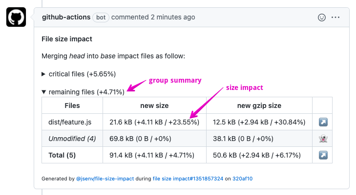

# File Size Impact

[](https://www.npmjs.com/package/@jsenv/file-size-impact)

`@jsenv/file-size-impact` analyzes a pull request's impact on file sizes and posts the results as a comment in your GitHub PR.

- ✅ Catch size impacts before merging pull requests
- 📦 Track compressed file sizes (gzip, brotli)
- 📊 Create meaningful reports by grouping files
- 🔄 Integrate with any CI/CD platform (GitHub Actions, Jenkins, etc.)

## Quick Start

```console
npm install --save-dev @jsenv/file-size-impact
```

1. Create a file size tracking script
2. Set up your CI workflow
3. Get size impact comments on every PR!

## Table of Contents

- [File Size Impact](#file-size-impact)
  - [Quick Start](#quick-start)
  - [Table of Contents](#table-of-contents)
  - [Pull Request Comment](#pull-request-comment)
  - [Installation](#installation)
    - [Step 1: Create a file size report script](#step-1-create-a-file-size-report-script)
    - [Step 2: Create a report script](#step-2-create-a-report-script)
    - [GitHub Workflow](#github-workflow)
    - [Other Tools](#other-tools)
  - [How it Works](#how-it-works)
  - [API Reference](#api-reference)
    - [generateFileSizeReport](#generatefilesizereport)
      - [Options](#options)
    - [reportFileSizeImpactInGitHubPullRequest](#reportfilesizeimpactingithubpullrequest)

## Pull Request Comment

Here's how the PR comments look with explanations:



| Text                           | How to read it                                                                                                                |
| ------------------------------ | ----------------------------------------------------------------------------------------------------------------------------- |
| "remaining files (+4.71%)"     | There is a group of files named "remaining files" and pull request has an overall impact of _+4.71%_ on these files.          |
| "21.6 kB (+4.11 kB / +23.55%)" | The size after merge is _21.6 kB_. Pull request adds _4.11 kB_ representing an increase of _23.55%_ of the size before merge. |
| "_Unmodified (4)_"             | Sum of files in that group that are not impacted by the pull request.                                                         |
| _Total (5)_                    | Sum of files in that group.                                                                                                   |

## Installation

### Step 1: Create a file size report script

First, create a script that generates your file size report:

```js
// file_size.mjs
import { generateFileSizeReport } from "@jsenv/file-size-impact";

export const fileSizeReport = await generateFileSizeReport({
  log: process.argv.includes("--log"),
  rootDirectoryUrl: new URL("./", import.meta.url),
  trackingConfig: {
    dist: {
      "./dist/**/*": true,
      "./dist/**/*.map": false,
    },
  },
});
```

Test it locally:

```console
node ./file_size.mjs --log
```

### Step 2: Create a report script

```js
// report_file_size_impact.mjs
import {
  reportFileSizeImpactInGitHubPullRequest,
  readGitHubWorkflowEnv,
} from "@jsenv/file-size-impact";

await reportFileSizeImpactInGitHubPullRequest({
  ...readGitHubWorkflowEnv(),
  buildCommand: "npm run dist",
  fileSizeReportUrl: new URL("./file_size.mjs#fileSizeReport", import.meta.url),
});
```

### GitHub Workflow

Create a GitHub Actions workflow file:

```yml
# .github/workflows/file_size_impact.yml
name: file size impact

on: pull_request

jobs:
  file_size_impact:
    runs-on: ubuntu-latest
    name: file size impact
    steps:
      - name: Setup git
        uses: actions/checkout@v3
      - name: Setup node
        uses: actions/setup-node@v3
        with:
          node-version: "18.3.0"
      - name: Setup npm
        run: npm install
      - name: Report file size impact
        run: node ./report_file_size_impact.mjs
        env:
          GITHUB_TOKEN: ${{ secrets.GITHUB_TOKEN }}
```

That's it! Now your PRs will automatically get file size impact comments.

### Other Tools

If you want to use another CI tool like Jenkins:

1. **Create a GitHub token** with `repo` scope at https://github.com/settings/tokens/new
2. **Update your report script** to provide environment variables:

```js
// report_file_size_impact.mjs for Jenkins
import { reportFileSizeImpactInGitHubPullRequest } from "@jsenv/file-size-impact";

await reportFileSizeImpactInGitHubPullRequest({
  rootDirectoryUrl: process.env.WORKSPACE, // Jenkins workspace
  repositoryOwner: process.env.GITHUB_REPO_OWNER,
  repositoryName: process.env.GITHUB_REPO_NAME,
  pullRequestNumber: process.env.PULL_REQUEST_NUMBER,
  githubToken: process.env.GITHUB_TOKEN,
  buildCommand: "npm run dist",
  fileSizeReportUrl: new URL("./file_size.mjs#fileSizeReport", import.meta.url),
  runLink: {
    url: process.env.BUILD_URL,
    text: `${process.env.JOB_NAME}#${process.env.BUILD_ID}`,
  },
});
```

3. **Configure your CI job** to execute the necessary git commands:

```shell
git init
git remote add origin $GITHUB_REPOSITORY_URL
git fetch --no-tags --prune origin $PULL_REQUEST_HEAD_REF
git checkout origin/$PULL_REQUEST_HEAD_REF
npm install
node ./report_file_size_impact.mjs
```

## How it Works

The file size impact analysis follows these steps:

1. Checkout pull request base branch
2. Execute an install command (_npm install_ by default)
3. Run a build command (_npm run-script build_ by default)
4. Generate a baseline file size report
5. Merge pull request into its base
6. Rebuild files
7. Generate a second file size report
8. Analyze differences between the two reports
9. Post or update a comment in the pull request

## API Reference

### generateFileSizeReport

Scans the filesystem to compute file sizes with optional transformations:

```js
import {
  generateFileSizeReport,
  raw,
  gzip,
  brotli,
} from "@jsenv/file-size-impact";

const fileSizeReport = await generateFileSizeReport({
  rootDirectoryUrl: new URL("./", import.meta.url),
  trackingConfig: {
    "critical files": {
      "./dist/main.js": true,
      "./dist/main.css": true,
    },
    "remaining files": {
      "./dist/**/*.js": true,
      "./dist/**/*.css": true,
      "./dist/main.js": false, // Exclude files already in "critical files"
      "./dist/main.css": false, // Exclude files already in "critical files"
    },
  },
  transformations: { raw, gzip, brotli },
});
```

#### Options

- **rootDirectoryUrl**: Project root directory (required)
- **trackingConfig**: File groups to track (optional)
- **transformations**: Size transformations, like compression (optional)
- **manifestConfig**: Configuration for files with dynamic names (optional)

### reportFileSizeImpactInGitHubPullRequest

Analyzes PR impact and posts a comment with results:

```js
import { reportFileSizeImpactInGitHubPullRequest } from "@jsenv/file-size-impact";

await reportFileSizeImpactInGitHubPullRequest({
  logLevel: "info",
  rootDirectoryUrl: "file:///directory",
  githubToken: "xxx",
  repositoryOwner: "jsenv",
  repositoryName: "file-size-impact",
  pullRequestNumber: 10,
  installCommand: "npm install",
  buildCommand: "npm run build",
```
