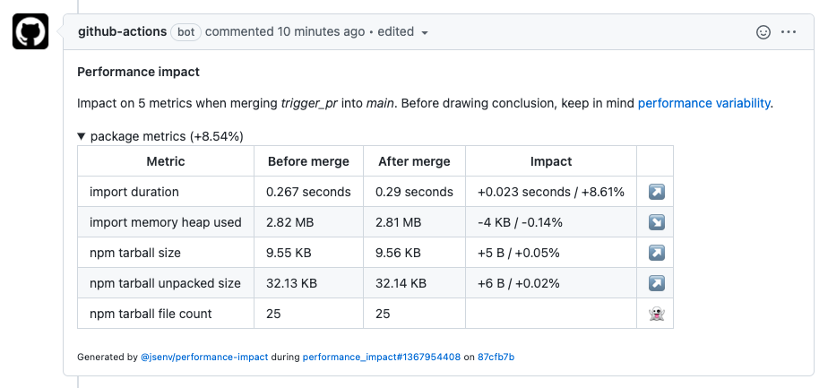

# Performance impact 

`@jsenv/performance-impact` analyses a pull request impact on your performance metrics. This analysis is posted in a comment of the pull request on GitHub.

- Helps you to catch big performance variations before merging a pull request
- Gives you the ability to measure performances on your machine during dev
- Can be added to any automated process (GitHub workflow, Jenkins, ...)

Disclaimer: This tool should not be used to catch small performance variations because they are hard to distinguish from the natural variations of performance metrics (see [performance variability](#Performance-variability)).

## Pull request comment

_Screenshot of a pull request comment_

## Performance variability

Performance metrics will change due to inherent variability, **even if there hasn't been a code change**.
It can be mitigated by measuring performance multiple times.
But you should always keep in mind this variability before drawing conclusions about a performance-impacting change.

With time you'll be capable to recognize unusual variation in your performance metrics.

## How to catch small performance impacts?

Catching (very) small performance impacts with confidence requires repetition and time. You need to:

1. Let your code be used a lot of times in a lot of scenarios and see the results. This could be scripts, real users or both.

2. And or push your performance metrics in a tool like Kibana or DataDog and check the tendency of your performance metrics.

In any case it means you have to wait before knowing the real performance impact.

## Recommended approach to catch performance impacts

1. measure some performance metrics
2. Big variations can be anticipated and catched by `@jsenv/performance-impact`
3. For small variations, upload performance metrics to a dashboard. Then, periodically watch the dashboard to check performance metrics tendency over time
