# [side_effects_advanced.test.mjs](../side_effects_advanced.test.mjs)

```js
console.info(`build "./main.html"`);
process.stdout.write("⠋ generate source graph\n");
process.stdout.write("✔ generate source graph (done in 0.02 second)\n");
process.stdout.write("⠋ generate build graph\n");
process.stdout.write("✔ generate build graph (done in 0.005 second)\n");
process.stdout.write("⠋ write files in build directory\n");
writeFileSync(new URL("./build/toto.txt", import.meta.url), "toto");
writeFileSync(new URL("./build/tata.txt", import.meta.url), "tata");
process.stdout.write(
  "✔ write files in build directory (done in 0.002 second)\n",
);
console.info(`--- build files ---  
- html : 1 (175 B / 91 %)
- js   : 1 (17 B / 9 %)
- total: 2 (192 B / 100 %)
--------------------`);
```

# 1/4 logs

```console
build "./main.html"
build "./main.html"
⠋ generate source graph
✔ generate source graph (done in <X> second)
⠋ generate build graph
✔ generate build graph (done in <X> second)
⠋ write files in build directory

```

# 2/4 write 2 files into "./build/"

## toto.txt
```txt
toto
```

## tata.txt
```txt
tata
```

# 3/4 logs



<details>
  <summary>see without style</summary>

```console
✔ write files in build directory (done in <X> second)
--- build files ---  
- html : 1 (175 B / 91 %)
- js   : 1 (17 B / 9 %)
- total: 2 (192 B / 100 %)
--------------------
--- build files ---  
- html : 1 (175 B / 91 %)
- js   : 1 (17 B / 9 %)
- total: 2 (192 B / 100 %)
--------------------
```

</details>


# 4/4 resolve

```js
undefined
```

---

<sub>
  Generated by <a href="https://github.com/jsenv/core/tree/main/packages/tooling/snapshot">@jsenv/snapshot</a>
</sub>
