# [side_effects_log.test.mjs](../side_effects_log.test.mjs)

```js
console.log(" Hi[0m <toto>");
```

# 1/2 logs



<details>
  <summary>see without style</summary>

```console
 Hi[0m <toto>
 Hi[0m <toto>
```

</details>


# 2/2 return

```js
undefined
```

---

<sub>
  Generated by <a href="https://github.com/jsenv/core/tree/main/packages/tooling/snapshot">@jsenv/snapshot</a>
</sub>
