# [file_then_throw.test.mjs](../file_then_throw.test.mjs)

```js
try {
  await snapshotTests(
    import.meta.url,
    ({ test }) => {
      test("scenario", () => {
        throw new Error("here");
      });
    },
    {
      executionEffects: { catch: true },
      throwWhenDiff: true,
      outFilePattern: "./git_ignored/[filename]",
    },
  );
} catch (e) {
  replaceFileStructureSync({
    from: new URL("./scenario/", outDirectoryUrl),
    to: new URL("./result/second/", import.meta.url),
  });
  throw e;
}
```



<details>
  <summary>see without style</summary>

```console
AssertionError: snapshot comparison failed for "scenario.md"

actual:  1| # [scenario](../../file_then_throw.test.mjs#L45)
         2| 
         3| ```js
         4| throw new Error("here");
         5| ```
         6| 
         7| ```console
         8| Error: here
         9|   at base/file_then_throw.test.mjs:46:19
        10|   at capture (@jsenv/core/packages/tooling/snapshot/src/side_effects/create_capture_sid…
        11|   at snapshotTests (@jsenv/core/packages/tooling/snapshot/src/side_effects/snapshot_tes…
        12|   at async snapshotSideEffects.filesystemEffects (base/file_then_throw.test.mjs:42:7)
        13|   at async base/file_then_throw.test.mjs:38:1
        14| ```
        15| 
        16| ---
        17| 
        18| <sub>
        19|   Generated by <a href="https://github.com/jsenv/core/tree/main/packages/tooling/snapsh…
        20| </sub>
        21| 
expect:  1| # [scenario](../../file_then_throw.test.mjs#L24)
         2| 
         3| ```js
         4| writeFileSync(fileTxtUrl, "a");
         5| ```
         6| 
         7| # 1/2 write file "./output/file.txt"
         8| 
         9| see [./output/file.txt](./output/file.txt)
        10| 
        11| # 2/2 return
        12| 
        13| ```js
        14| undefined
        15| ```
        16| 
        17| ---
        18| 
        19| <sub>
        20|   Generated by <a href="https://github.com/jsenv/core/tree/main/packages/tooling/snapsh…
        21| </sub>
        22| 
--- details ---
"@jsenv/core/packages/tooling/snapshot/tests/snapshot_tests/file_then_throw/git_ignored/scenario/scenario.md"
---------------
  at Object.compare (@jsenv/core/packages/tooling/snapshot/src/filesystem_snapshot.js:120:7)
  at Object.compare (@jsenv/core/packages/tooling/snapshot/src/filesystem_snapshot.js:279:22)
  at Object.compare (@jsenv/core/packages/tooling/snapshot/src/filesystem_snapshot.js:279:22)
  at Object.compare (@jsenv/core/packages/tooling/snapshot/src/filesystem_snapshot.js:218:25)
  at snapshotTests (@jsenv/core/packages/tooling/snapshot/src/side_effects/snapshot_tests.js:230:24)
  at async snapshotSideEffects.filesystemEffects (@jsenv/core/packages/tooling/snapshot/tests/snapshot_tests/file_then_throw/file_then_throw.test.mjs:42:7)
  at async @jsenv/core/packages/tooling/snapshot/tests/snapshot_tests/file_then_throw/file_then_throw.test.mjs:38:1
```

</details>


---

<sub>
  Generated by <a href="https://github.com/jsenv/core/tree/main/packages/tooling/snapshot">@jsenv/snapshot</a>
</sub>
