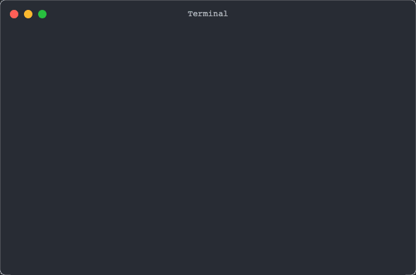

# Terminal Recorder [](https://www.npmjs.com/package/@jsenv/terminal-recorder)

Create beautiful terminal recordings in multiple formats for documentation and demos.

🎬 Generate static SVGs of terminal output  
🎭 Create animated GIF recordings  
🎥 Export MP4 and WebM videos  
🎨 Full ANSI color and Unicode support

## Output Examples

### SVG (Static)


### GIF (Animated)



## Installation

```console
npm install @jsenv/terminal-recorder
```

## Quick Start

```js
import { writeFileSync } from "node:fs";
import { startTerminalRecording } from "@jsenv/terminal-recorder";

// Start recording with multiple output formats
const recorder = await startTerminalRecording({
  svg: { title: "Terminal Demo" },
  gif: true,
  video: true,
});

// Write terminal content with ANSI color codes
recorder.write("[1;32mHello[0m [1;34mWorld![0m");

// Wait a moment for animation
await new Promise((resolve) => setTimeout(resolve, 500));

// Stop recording and get results
const result = await recorder.stop();

// Save in different formats
writeFileSync("./terminal.svg", await result.svg());
writeFileSync("./terminal.gif", await result.gif());
writeFileSync("./terminal.mp4", await result.mp4());
writeFileSync("./terminal.webm", await result.webm());
```

## Full Example

```js
import { writeFileSync } from "node:fs";
import { startTerminalRecording } from "@jsenv/terminal-recorder";

const terminalRecorder = await startTerminalRecording({
  svg: {
    title: "Terminal",
  },
  video: true,
  gif: true,
});

// Show colorful text with delays between each line
const datas = [
  `[31mred[39m `,
  `[33myellow[39m `,
  `[32mgreen[39m `,
  `[36mcyan[39m `,
  `[34mblue[39m `,
  `[35mmagenta[39m`,
];

for (const data of datas) {
  terminalRecorder.write(data);
  await new Promise((resolve) => setTimeout(resolve, 200));
}

// Stop recording and export all formats
const result = await terminalRecorder.stop();

// Save outputs
const svg = await result.svg();
writeFileSync(new URL("./terminal.svg", import.meta.url), svg);

const gif = await result.gif();
writeFileSync(new URL("./terminal.gif", import.meta.url), gif);

const webm = await result.webm();
writeFileSync(new URL("./terminal.webm", import.meta.url), webm);

const mp4 = await result.mp4();
writeFileSync(new URL("./terminal.mp4", import.meta.url), mp4);
```

## API Reference

### startTerminalRecording(options)

Starts a terminal recording session with the specified options.

```js
const recorder = await startTerminalRecording({
  // SVG options (set to false to disable)
  svg: {
    title: "My Terminal", // Title shown in the terminal window
    width: 800, // Width in pixels
    height: 400, // Height in pixels
    fontSize: 14, // Font size in pixels
    fontFamily: "monospace", // Font family
    theme: {
      // Terminal color theme
      background: "#1e1e1e",
      foreground: "#ffffff",
      // Additional theme options...
    },
  },

  // Enable video output formats (WebM, MP4)
  video: true,

  // Enable GIF output
  gif: {
    fps: 10, // Frames per second
    quality: 80, // Quality (1-100)
    repeat: 0, // 0 = loop forever, -1 = no repeat, n = repeat n times
  },

  // Terminal configuration
  cols: 80, // Number of columns
  rows: 24, // Number of rows
});
```

### recorder.write(data)

Writes data to the terminal. Supports ANSI color codes and escape sequences.

```js
// Simple text
recorder.write("Hello World");

// With ANSI colors
recorder.write("\x1b[31mRed Text\x1b[0m");

// With SGR parameters
recorder.write("[1;32mBold Green[0m");
```

### recorder.stop()

Stops the recording and returns a result object with methods to generate different output formats.

```js
const result = await recorder.stop();

// Get SVG string
const svg = await result.svg();

// Get GIF buffer
const gif = await result.gif();

// Get WebM video buffer
const webm = await result.webm();

// Get MP4 video buffer
const mp4 = await result.mp4();
```

## How It Works

- **SVG generation**: Direct rendering of terminal state to SVG
- **Animated formats**: Uses [xterm.js](https://xtermjs.org/) in Chrome headless via Playwright
- **Video encoding**: Leverages browser's video encoding capabilities

## Compatibility

- Node.js: 16.x and above
- Requires Playwright for animated formats
- Works on macOS, Linux, and Windows

## Use Cases

- Create documentation with terminal examples
- Record CLI tool demos for README files
- Generate terminal screenshots for blog posts
- Create animated terminal presentations

## Contributing

Contributions are welcome! Please feel free to submit a Pull Request.

## License

[MIT](./LICENSE)
