# [0_without_collapse](../../border_collapse.test.mjs)

```js
run({
  borderCollapse: false,
})
```

# 1/2 console.log



<details>
  <summary>see without style</summary>

```console
--- top_left_empty ---
               ┌──────────────┐
  top_left     │ top_right    │
               └──────────────┘
┌─────────────┐┌──────────────┐
│ bottom_left ││ bottom_right │
└─────────────┘└──────────────┘
--- top_right_empty ---
┌─────────────┐                
│ top_left    │  top_right     
└─────────────┘                
┌─────────────┐┌──────────────┐
│ bottom_left ││ bottom_right │
└─────────────┘└──────────────┘
--- bottom_right_empty ---
┌─────────────┐┌──────────────┐
│ top_left    ││ top_right    │
└─────────────┘└──────────────┘
┌─────────────┐                
│ bottom_left │  bottom_right  
└─────────────┘                
--- bottom_left_empty ---
┌─────────────┐┌──────────────┐
│ top_left    ││ top_right    │
└─────────────┘└──────────────┘
               ┌──────────────┐
  bottom_left  │ bottom_right │
               └──────────────┘
--- all ---
┌─────────────┐┌──────────────┐
│ top_left    ││ top_right    │
└─────────────┘└──────────────┘
┌─────────────┐┌──────────────┐
│ bottom_left ││ bottom_right │
└─────────────┘└──────────────┘
--- all_3_row ---
┌──────────┐┌──────────┐┌──────────┐
│ column_a ││ column_b ││ column_c │
└──────────┘└──────────┘└──────────┘
--- all_3_column ---
┌───────┐
│ row_a │
└───────┘
┌───────┐
│ row_b │
└───────┘
┌───────┐
│ row_c │
└───────┘
--- nine_cells_middle_use_yellow_borders ---
┌─────────────┐┌────────┐┌──────────────┐
│ top_left    ││ top    ││ top_right    │
└─────────────┘└────────┘└──────────────┘
┌─────────────┐┌────────┐┌──────────────┐
│ left        ││ center ││ right        │
└─────────────┘└────────┘└──────────────┘
┌─────────────┐┌────────┐┌──────────────┐
│ bottom_left ││ bottom ││ bottom_right │
└─────────────┘└────────┘└──────────────┘
```

</details>


# 2/2 return

```js
undefined
```

---

<sub>
  Generated by <a href="https://github.com/jsenv/core/tree/main/packages/tooling/snapshot">@jsenv/snapshot</a>
</sub>
