# [1_border_colors](../../table_1_cell.test.mjs#L119)

```js
run({
  borderColors: true,
})
```

# 1/2 console.log



<details>
  <summary>see without style</summary>

```console
--- none ---
 a 
--- top ---
───
 a 
--- left ---
│ a 
--- bottom ---
 a 
───
--- right ---
 a │
--- top_left ---
┌───
│ a 
--- top_right ---
───┐
 a │
--- bottom_right ---
 a │
───┘
--- bottom_left ---
│ a 
└───
--- left_and_right ---
│ a │
--- top_and_bottom ---
───
 a 
───
--- all_but_top ---
│ a │
└───┘
--- all_but_right ---
┌───
│ a 
└───
--- all_but_left ---
───┐
 a │
───┘
--- all_but_bottom ---
┌───┐
│ a │
--- all ---
┌───┐
│ a │
└───┘
```

</details>


# 2/2 return

```js
undefined
```

---

<sub>
  Generated by <a href="https://github.com/jsenv/core/tree/main/packages/tooling/snapshot">@jsenv/snapshot</a>
</sub>
