# [2_border_colors](../../table_2_cells_same_column.test.mjs#L139)

```js
run({
  borderColors: true,
})
```

# 1/2 console.log



<details>
  <summary>see without style</summary>

```console
--- bottom_and_top ---
 a 
───
───
 b 
--- bottom_left_and_top_left ---
│ a 
└───
┌───
│ b 
--- left_bottom_and_left ---
│ a 
├───
│ b 
--- left_and_top_left ---
│ a 
├───
│ b 
--- bottom_right_and_top_right ---
 a │
───┘
───┐
 b │
--- right_bottom_and_right ---
 a │
───┤
 b │
--- right_and_top_right ---
 a │
───┤
 b │
--- top_left_and_bottom_right ---
┌───╴
│ a  
  b │
╶───┘
--- bottom_right_and_top_left ---
  a │
╶───┘
┌───╴
│ b  
--- left_bottom_right ---
│ a  
└───┐
  b │
--- left_and_top_right ---
│ a  
└───┐
  b │
--- all_but_bottom_and_all_but_top ---
┌───┐
│ a │
│ b │
└───┘
--- all_but_bottom_and_all ---
┌───┐
│ a │
├───┤
│ b │
└───┘
--- all_and_all_but_top ---
┌───┐
│ a │
├───┤
│ b │
└───┘
--- all ---
┌───┐
│ a │
└───┘
┌───┐
│ b │
└───┘
```

</details>


# 2/2 return

```js
undefined
```

---

<sub>
  Generated by <a href="https://github.com/jsenv/core/tree/main/packages/tooling/snapshot">@jsenv/snapshot</a>
</sub>
